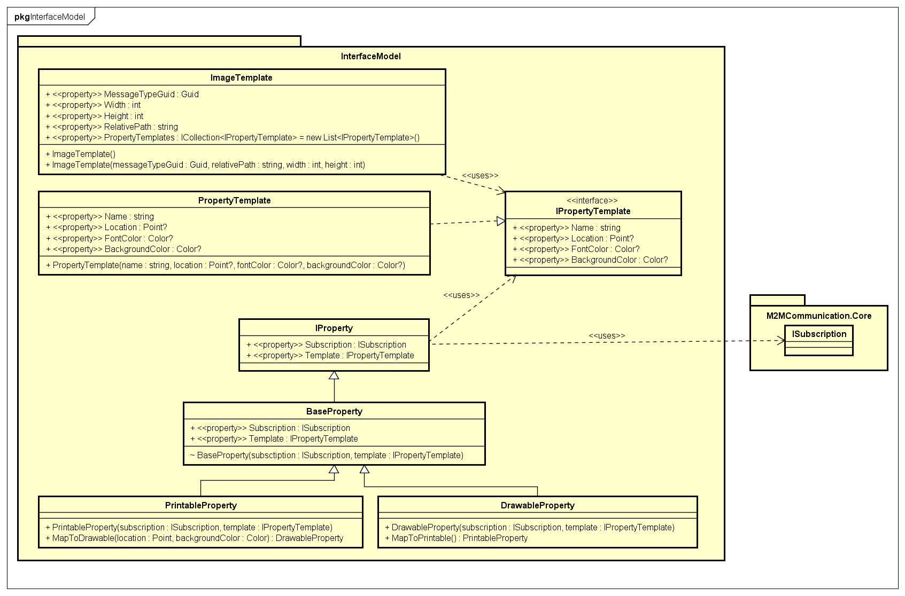

# Interface model

This project contains the model used for displaying data (Model) to the end user and provides means to persist them (Repositories).

## Model

Parsing the message starts with getting an appropriate template from the repository. The template is represented by an object of type `ImageTemplate`, which contains properties of the image used as the background, as well as a collection of `IPropertyTemplate`s, which define how the properties of the received data are going to be drawn.

In the process of parsing, for each of the `PropertyTemplates` parser creates a `DrawableProperty` which is then used directly by the interface to display them. Any properties of the received data that do not have a corresponding template will become a `PrintableProperty`, which then will be printed below the image.

### UML Class Diagram

## Repositories

The only repository is a temporary mock.
