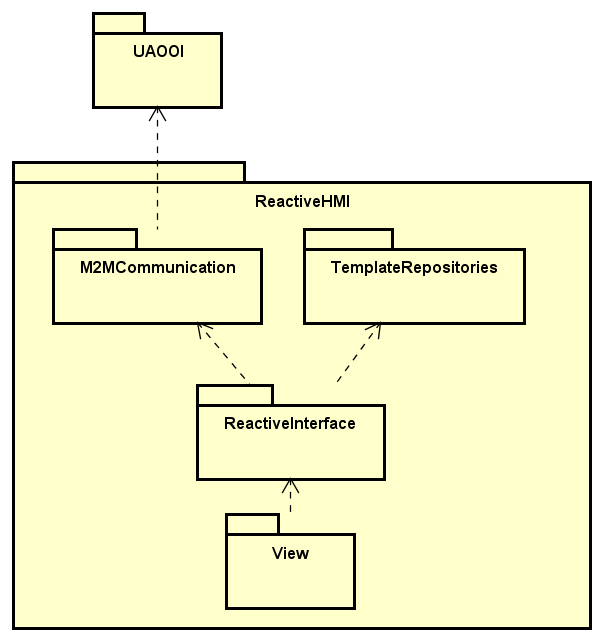

# OPC-UA-OOI-webapp

Web application built using .NET Core 10.0 with Blazor Server as an example usage of OPC-UA PubSub Standard

Application depends on open-source NuGet packages developed by [Mariusz Postół on github](https://github.com/mpostol/OPC-UA-OOI).

## Goals

- Implementing OPC-UA Part 14 PubSub protocol for m2m communication
- Designing application architecture based on dependency injection
- Handling and displaying asynchronous data from IoT machines
- Designing graphical interface which changes based on the type of the data received

## Build steps

- Download and install [.Net Core 10](https://github.com/aspnet/AspNetCore/releases/tag/v10.0.0)
- Clone or download this repository
- Either:
  - Use **dotnet CLI**:
    - Navigate to `ReferenceWebApplication` project's directory (*project*, not *solution*)
    - Open command line and run `dotnet run`
    - Open a browser and navigate to `https://localhost:5001` (unless this port was already taken)
  - Use **Visual Studio 2022**:
    - Make sure you have installed necessary Visual Studio tools for developing ASP.Net Applications
    - Open the `ReferenceWebApplication` solution
    - Choose IIS Express in the dropdown menu in the build toolbar
    - Build and run - this should open a browser with the right URL

## Packages

The application is split into the following packages:

| Package | Description |
| :------: | :------------ |
| [M2M Communication](M2M) | Package focused on communicating between IoT machines using OPC-UA standard |
| [Reactive interface](ReactiveInterface) | Package focused onmodeling the received data and preparing it to be displayed |
| [Reference Web Application](ReferenceWebApplication) | Package focused on configuration of the application and its graphical interface |

### Package diagram

