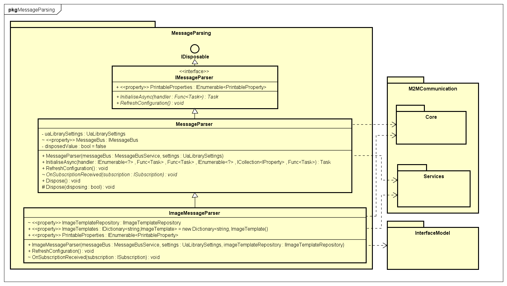

# Reactive interface

Project that targets handling received data from M2M communication. Contains a simple hierarchy of one interface, one base class and `ImageMessageParser` implemetation, which is used as a service and therefore is injected in the interface's view models.

## UML class diagram

