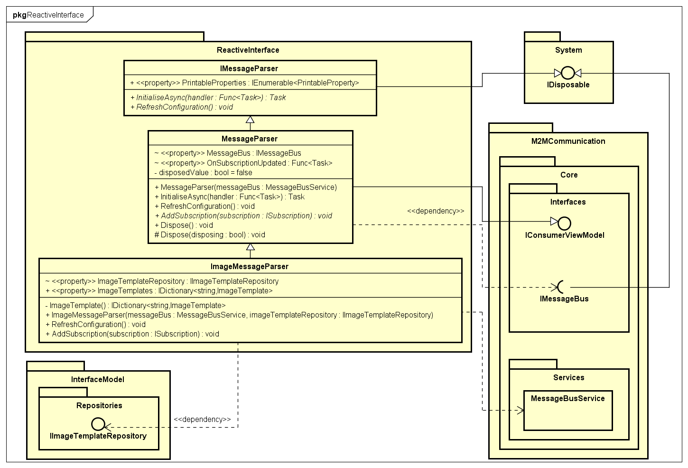

# Reactive interface

A module that targets handling received data from M2M communication. Contains a simple hierarchy of one interface, one base class and `ImageMessageParser` implemetation, which is used as a service and therefore is injected in the interface's view models.

Parsing starts with injecting a message bus into an `ImageMessageParser` and initialising the bus with `MessageParser`'s instance which also implements `IConsumerViewModel`. The bus then starts communication and calls back the message parser each time there is a new `Subscription` bound. Message parser analyses the type and repository group of the subscription, checks whether can it be assigned to an `ImageTemplate` and creates either a `DrawableProperty` or a `PrintableProperty` based on that with the subscription as its value. Those properties are used directly in the [blazor components](../Components)

## UML class diagram

